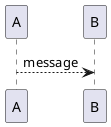

# Vuepress template

## NPM

```bash
# install dependencies
npm install

# start devenv
npm run dev

# build the doc
npm run build

#serve the doc
npm run start
```

## Config

```javascript
// docs/config.js
module.exports = {
  // title: 'Site Title',
  // description: 'Site Description',
}
```

## Markdown

> [Vuepress extensions](https://vuepress.vuejs.org/guide/markdown.html)


### Anchors
- Headers automatically get anchor links applied. Rendering of anchors can be configured using the [`markdown.anchor`](https://vuepress.vuejs.org/config/#markdown-anchor) option.


### Links

Given the following directory structure:

```
.
├─ README.md
├─ foo
│  ├─ README.md
│  ├─ one.md
│  └─ two.md
└─ bar
   ├─ README.md
   ├─ three.md
   └─ four.md
```

```md
[Home](/) <!-- Sends the user to the root README.md -->
[foo](/foo/) <!-- Sends the user to index.html of directory foo -->
[foo heading anchor](/foo/#heading) <!-- Anchors user to a heading in the foo README file -->
[foo - one](/foo/one.html) <!-- You can append .html -->
[foo - two](/foo/two.md) <!-- Or you can append .md -->
```

### Front Matter

[YAML front matter](https://jekyllrb.com/docs/frontmatter/) is supported out of the box:

``` yaml
---
title: Blogging Like a Hacker
lang: en-US
---
```

The data will be available to the rest of the page, plus all custom and theming components as `$page`.

`title` and `lang` will be automatically set on the current page. In addition you can specify extra meta tags to be injected:

``` yaml
---
meta:
  - name: description
    content: hello
  - name: keywords
    content: super duper SEO
---
```

### GitHub Style tables

```md
| Tables        | Are           | Cool  |
| ------------- |:-------------:| -----:|
| col 3 is      | right-aligned | $1600 |
| col 2 is      | centered      |   $12 |
| zebra stripes | are neat      |    $1 |
```

| Tables        | Are           | Cool  |
| ------------- |:-------------:| -----:|
| col 3 is      | right-aligned | $1600 |
| col 2 is      | centered      |   $12 |
| zebra stripes | are neat      |    $1 |

### Footnotes

```md
Here is an inline note.^[Inlines notes are easier to write, since
you don't have to pick an identifier and move down to type the
note.]

Here is a footnote reference,[^1] and another.[^longnote]

[^1]: Here is the footnote.

[^longnote]: Here's one with multiple blocks.

    Subsequent paragraphs are indented to show that they
belong to the previous footnote.
```
## Code Blocks with Line Highlighting

````
``` js{4}
export default {
  data () {
    return {
      msg: 'Highlighted!'
    }
  }
}
```
````

``` js{4}
export default {
  data () {
    return {
      msg: 'Highlighted!'
    }
  }
}
```

### UML

> See [Plantuml Language](http://plantuml.com/)

```md
<!-- from file -->

```

````md
<!-- block -->

````


### Math

See [Function Support in KaTeX](https://github.com/Khan/KaTeX/wiki/Function-Support-in-KaTeX)

```md
<!-- inline -->
$\sqrt(x^3)$
```

```md
<!-- block -->
$$
\sqrt(x^3)
$$
```

$$
\sqrt(x^3)
$$
